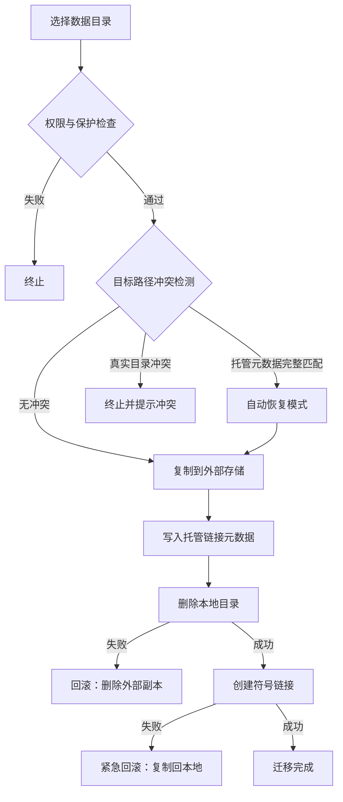

# 数据迁移基础实现


AppPorts 的数据迁移功能用于将应用关联的数据目录（如 `~/Library/Application Support`、`~/Library/Caches` 等）迁移至外部存储，从而释放本地磁盘空间。

## 核心策略：符号链接

数据目录迁移采用**整体符号链接**策略，流程如下：

1. 将原始本地目录完整复制到外部存储。
2. 在外部目录写入托管链接元数据（`.appports-link-metadata.plist`）。
3. 删除本地原始目录。
4. 在原始路径创建符号链接，指向外部存储中的副本。

```
~/Library/Application Support/SomeApp
    → /Volumes/External/AppPortsData/SomeApp  （符号链接）
```

## 迁移流程



## 托管链接元数据

AppPorts 在外部目录中写入 `.appports-link-metadata.plist` 文件，用于标识该目录由 AppPorts 管理。元数据包含：

| 字段 | 说明 |
|------|------|
| `schemaVersion` | 元数据版本号（当前为 1） |
| `managedBy` | 管理者标识（`com.shimoko.AppPorts`） |
| `sourcePath` | 原始本地路径 |
| `destinationPath` | 外部存储目标路径 |
| `dataDirType` | 数据目录类型 |

扫描阶段会使用该元数据区分 AppPorts 创建的托管链接和用户手动创建的符号链接。迁移中断时，它也可用于自动恢复。

自动恢复采用严格匹配策略。外部目标目录已存在时，AppPorts 只有在 `schemaVersion`、`managedBy`、`sourcePath`、`destinationPath` 和 `dataDirType` 全部与当前任务一致时，才会认为这是可接续的 AppPorts 托管目录。没有 metadata、metadata 不完整或路径/类型不一致的真实目录都会被视为冲突，AppPorts 不会仅凭目录大小相近就接管或覆盖。

## 支持的数据目录类型

| 类型 | 路径示例 |
|------|----------|
| `applicationSupport` | `~/Library/Application Support/` |
| `preferences` | `~/Library/Preferences/` |
| `containers` | `~/Library/Containers/` |
| `groupContainers` | `~/Library/Group Containers/` |
| `caches` | `~/Library/Caches/` |
| `webKit` | `~/Library/WebKit/` |
| `httpStorages` | `~/Library/HTTPStorages/` |
| `applicationScripts` | `~/Library/Application Scripts/` |
| `logs` | `~/Library/Logs/` |
| `savedState` | `~/Library/Saved Application State/` |
| `dotFolder` | `~/.npm`、`~/.vscode` 等 |
| `custom` | 用户自定义路径 |

## 还原流程

1. 验证本地路径为符号链接，且指向有效的外部目录。
2. 移除本地符号链接。
3. 将外部目录复制回本地。
4. 删除外部目录（尽力而为）。

如果复制失败，AppPorts 会自动重建符号链接，以保证状态一致。

## 错误处理与回滚

迁移过程中的每个关键步骤均包含回滚机制：

- **复制失败**：不执行后续操作，并清理已复制的外部文件。
- **目标目录冲突**：如果外部目标已有真实目录且 metadata 不完整匹配，停止迁移并保留双方数据，由用户手动确认。
- **删除本地目录失败**：删除外部副本，恢复原始状态。
- **创建符号链接失败**：将数据从外部复制回本地，并删除外部副本。

这种设计可确保在关键阶段发生故障时，数据不丢失，系统状态也尽量保持一致。
