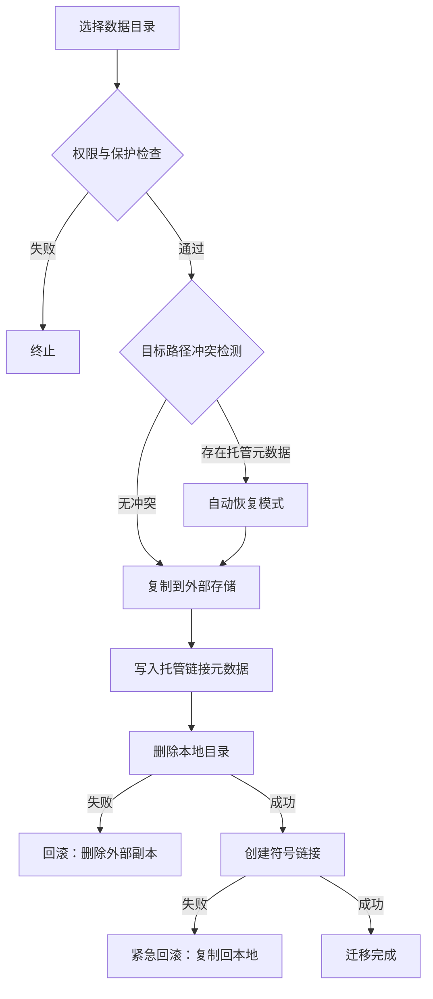

# 数据迁移基础实现

AppPorts 的数据迁移功能负责将应用关联的数据目录（如 `~/Library/Application Support`、`~/Library/Caches` 等）迁移至外部存储，以释放本地磁盘空间。

## 核心策略：符号链接

数据目录迁移采用**整体符号链接**策略，流程如下：

1. 将原始本地目录完整复制到外部存储
2. 在外部目录写入托管链接元数据（`.appports-link-metadata.plist`）
3. 删除本地原始目录
4. 在原始路径创建符号链接，指向外部存储中的副本

```
~/Library/Application Support/SomeApp
    → /Volumes/External/AppPortsData/SomeApp  （符号链接）
```

## 迁移流程



## 托管链接元数据

AppPorts 在外部目录中写入 `.appports-link-metadata.plist` 文件，用于标识该目录由 AppPorts 管理。元数据包含：

| 字段 | 说明 |
|------|------|
| `schemaVersion` | 元数据版本号（当前为 1） |
| `managedBy` | 管理者标识（`com.shimoko.AppPorts`） |
| `sourcePath` | 原始本地路径 |
| `destinationPath` | 外部存储目标路径 |
| `dataDirType` | 数据目录类型 |

该元数据在扫描阶段用于区分 AppPorts 创建的托管链接与用户手动创建的符号链接，并在迁移中断时支持自动恢复。

## 支持的数据目录类型

| 类型 | 路径示例 |
|------|----------|
| `applicationSupport` | `~/Library/Application Support/` |
| `preferences` | `~/Library/Preferences/` |
| `containers` | `~/Library/Containers/` |
| `groupContainers` | `~/Library/Group Containers/` |
| `caches` | `~/Library/Caches/` |
| `webKit` | `~/Library/WebKit/` |
| `httpStorages` | `~/Library/HTTPStorages/` |
| `applicationScripts` | `~/Library/Application Scripts/` |
| `logs` | `~/Library/Logs/` |
| `savedState` | `~/Library/Saved Application State/` |
| `dotFolder` | `~/.npm`、`~/.vscode` 等 |
| `custom` | 用户自定义路径 |

## 还原流程

1. 验证本地路径为符号链接且指向有效外部目录
2. 移除本地符号链接
3. 将外部目录复制回本地
4. 删除外部目录（尽力而为）

若复制失败，自动重建符号链接以保证一致性。

## 错误处理与回滚

迁移过程中的每个关键步骤均包含回滚机制：

- **复制失败**：不执行后续操作，清理已复制的外部文件
- **删除本地目录失败**：删除外部副本，恢复原始状态
- **创建符号链接失败**：将数据从外部复制回本地，删除外部副本

这种设计确保在任何阶段发生故障时，数据不会丢失且系统状态保持一致。