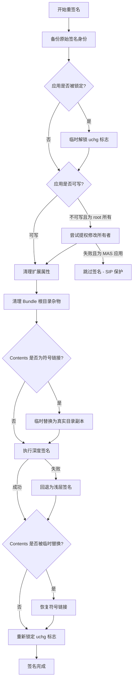

# 重签名与崩溃防护


## 为什么迁移数据后应用可能崩溃

macOS 的代码签名机制（`codesign`）会验证应用包完整性，包括文件路径结构。当 AppPorts 将应用的数据目录迁移至外部存储并替换为符号链接后，签名密封可能被破坏，并导致以下问题：

- **Gatekeeper 拦截**：`codesign --verify --deep --strict` 检测到签名失效，系统弹出「已损坏」或「来自身份不明的开发者」对话框，阻止应用启动。
- **Keychain 访问中断**：依赖 Keychain 访问组的应用可能因签名身份变更，无法读取已存储的凭据。
- **授权（Entitlements）失效**：部分应用的授权与签名身份绑定，签名变更后可能出现授权不匹配。

### 高风险应用类型

| 应用类型 | 风险等级 | 原因 |
|----------|----------|------|
| Sparkle 自更新应用 | **高** | 更新器可能删除或替换应用，破坏符号链接 |
| Electron 自更新应用 | **高** | `electron-updater` 可能干扰外部存储上的应用 |
| 依赖 Keychain 的应用 | **高** | Ad-hoc 签名变更了签名身份，Keychain 访问组失效 |
| Mac App Store 应用 | **高** | SIP 保护，无法重签名 |
| 原生自更新应用（Chrome、Edge） | 中 | 自更新可能替换外部副本，使本地入口失效 |
| iOS 应用（Mac 版） | 低 | 使用 Stub Portal 或整体符号链接时，签名问题较少 |

### 高风险数据目录类型

| 数据类型 | 风险等级 | 原因 |
|----------|----------|------|
| `~/Library/Application Support/` | 中 | 应用可能使用文件锁、SQLite WAL 日志或扩展属性，跨符号链接访问时可能异常 |
| `~/Library/Group Containers/` | 中 | 同一 Team 下多个应用共享，符号链接可能干扰其他应用 |
| `~/Library/Preferences/` | 低-中 | `cfprefsd` 缓存 plist 文件，符号链接可能导致读取过期数据 |
| `~/Library/Caches/` | 低 | 缓存可重建，多数应用可优雅处理缓存缺失 |

## 重签名机制

### 迁移后的重签名确认

在数据目录页迁移 `Containers` 或 `Group Containers` 相关数据时，AppPorts 会在开始迁移前询问是否在迁移完成后对关联应用执行 Ad-hoc 重签名。选择「同意重签名」会先备份原始签名，再在迁移完成后对真实应用路径执行重签名；选择「不同意，仅迁移」则不会自动修改应用签名。

该确认用于降低容器数据迁移后应用无法识别数据、提示异常或启动异常的风险。对微信、聊天工具、依赖 Keychain 或容器权限较多的应用，建议先做好独立备份，再按提示选择是否重签名。

### Ad-hoc 签名

AppPorts 使用 **Ad-hoc 签名**（无证书的本地签名）来修复迁移后的应用签名。执行命令：

```bash
codesign --force --deep --sign - <应用路径>
```

其中 `-` 表示 Ad-hoc 签名（不使用开发者证书）。

### 签名流程



### 关键步骤说明

1. **备份原始签名身份**：签名前读取应用当前的签名身份信息（通过 `codesign -dvv` 解析 `Authority=` 行），并保存至 `~/Library/Application Support/AppPorts/signature-backups/<BundleID>.plist`。

2. **清理扩展属性**：执行 `xattr -cr` 移除资源分支、Finder 信息等，避免签名时出现 "detritus not allowed" 错误。

3. **清理 Bundle 根目录**：移除 `.DS_Store`、`__MACOSX`、`.git`、`.svn` 等杂物。

4. **处理符号链接的 Contents**：如果 `Contents/` 是符号链接（Deep Contents Wrapper 策略），临时将其替换为真实目录副本，签名完成后再恢复符号链接。

5. **深度签名 → 浅层签名回退**：优先执行 `--deep` 签名（覆盖所有嵌套组件）。如果因权限或资源分支问题失败，则回退为不带 `--deep` 的浅层签名。

6. **重试机制**：`codesign` 出现 "internal error" 或被 SIGKILL 终止时，最多重试 2 次。

## 签名备份与恢复

### 已链接应用的路径解析

对于状态为「已链接」的应用，签名操作会自动解析**外部真实应用路径**，而不是本地 Stub Portal 壳或符号链接。解析策略如下：

| 迁移方式 | 解析方法 |
|----------|----------|
| Whole App Symlink | 解析符号链接目标，返回外部真实 `.app` 路径 |
| Stub Portal | 读取本地入口中记录的外部真实应用路径 |

这意味着备份、恢复和重签名操作始终作用于真实应用包，从而确保签名变更真正生效。

### 备份

备份文件保存在 `~/Library/Application Support/AppPorts/signature-backups/` 目录下，以**真实应用的** `BundleID.plist` 命名：

| 字段 | 说明 |
|------|------|
| `bundleIdentifier` | 应用的 Bundle ID |
| `signingIdentity` | 原始签名身份，如 `Developer ID Application: ...` 或 `ad-hoc` |
| `originalPath` | 原始应用路径 |
| `backupDate` | 备份时间 |

备份在以下时机触发：

- 数据目录迁移前（若开启了自动重签名）：使用真实应用路径备份。
- 任何签名操作执行前：该操作幂等，不会覆盖已有备份。
- 手动执行「备份签名」时。

### 恢复

恢复签名时，AppPorts 根据备份的签名身份执行不同策略：

| 备份的签名身份 | 恢复行为 |
|---------------|----------|
| `ad-hoc` 或为空 | 执行 `codesign --remove-signature` 移除签名，删除备份 |
| 有效的开发者证书身份 | 检查钥匙串中是否存在该证书；若存在，使用原始身份重新签名 |
| 有效的开发者证书身份，但证书不在本机 | **回退为 Ad-hoc 签名**，原始签名无法完整恢复 |

### 恢复失败的情况

以下场景会导致签名恢复失败或不完整：

| 场景 | 结果 |
|------|------|
| 备份 plist 文件不存在 | 抛出 `noBackupFound` 错误，无法恢复 |
| 原始开发者证书不在本机钥匙串中 | 回退为 Ad-hoc 签名。应用可启动，但 Keychain 访问组和部分授权可能失效 |
| Mac App Store 应用（SIP 保护） | 静默跳过。SIP 会阻止对系统保护应用签名的修改 |
| 应用目录不可写且为 root 所有 | 尝试通过管理员权限修改所有者。若用户取消授权提示，则操作失败 |
| `Contents` 符号链接目标已丢失 | 临时替换步骤中 `copyItem` 失败，签名无法执行 |
| 用户取消管理员权限授权 | 抛出 `codesignFailed("用户取消了权限授权")` |
| 深度签名和浅层签名均失败 | 错误向上传播，签名操作失败 |

::: warning 关于开发者证书丢失
最常见的实际恢复失败场景是：原始应用由第三方开发者签名（如 `Developer ID Application: Google LLC`），但当前机器的钥匙串中没有对应的私钥。此时恢复操作只能生成 Ad-hoc 签名，**原始签名身份无法完整还原**。对于依赖特定签名身份的 Keychain 访问组或企业配置描述文件的应用，这可能导致功能异常。
:::
