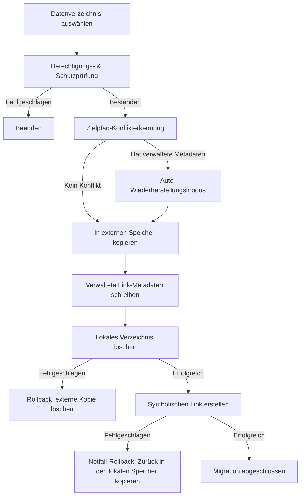

# Datenmigration - Grundlegende Implementierung


Die Datenmigrationsfunktion von AppPorts migriert app-assoziierte Datenverzeichnisse (wie `~/Library/Application Support`, `~/Library/Caches` usw.) in den externen Speicher, um lokalen Speicherplatz freizugeben.

## Kernstrategie: Symbolischer Link

Die Datenverzeichnismigration verwendet die **Whole Symlink**-Strategie:

1. Das gesamte ursprüngliche lokale Verzeichnis in den externen Speicher kopieren
2. Verwaltete Link-Metadaten (`.appports-link-metadata.plist`) im externen Verzeichnis schreiben
3. Das ursprüngliche lokale Verzeichnis löschen
4. Einen symbolischen Link am ursprünglichen Pfad erstellen, der auf die externe Kopie verweist

```
~/Library/Application Support/SomeApp
    → /Volumes/External/AppPortsData/SomeApp  (symlink)
```

## Migrationsablauf



## Verwaltete Link-Metadaten

AppPorts schreibt eine `.appports-link-metadata.plist`-Datei im externen Verzeichnis, um zu kennzeichnen, dass das Verzeichnis von AppPorts verwaltet wird. Die Metadaten enthalten:

| Feld | Beschreibung |
|------|--------------|
| `schemaVersion` | Metadaten-Versionsnummer (aktuell 1) |
| `managedBy` | Verwaltungskennung (`com.shimoko.AppPorts`) |
| `sourcePath` | Ursprünglicher lokaler Pfad |
| `destinationPath` | Externer Speicher-Zielpfad |
| `dataDirType` | Datenverzeichnistyp |

Diese Metadaten werden beim Scannen verwendet, um von AppPorts verwaltete Links von benutzererstellten symbolischen Links zu unterscheiden, und unterstützen die automatische Wiederherstellung bei unterbrochener Migration.

## Unterstützte Datenverzeichnistypen

| Typ | Pfadbeispiel |
|-----|-------------|
| `applicationSupport` | `~/Library/Application Support/` |
| `preferences` | `~/Library/Preferences/` |
| `containers` | `~/Library/Containers/` |
| `groupContainers` | `~/Library/Group Containers/` |
| `caches` | `~/Library/Caches/` |
| `webKit` | `~/Library/WebKit/` |
| `httpStorages` | `~/Library/HTTPStorages/` |
| `applicationScripts` | `~/Library/Application Scripts/` |
| `logs` | `~/Library/Logs/` |
| `savedState` | `~/Library/Saved Application State/` |
| `dotFolder` | `~/.npm`, `~/.vscode` usw. |
| `custom` | Benutzerdefinierter Pfad |

## Wiederherstellungsablauf

1. Überprüfen, ob der lokale Pfad ein symbolischer Link ist, der auf ein gültiges externes Verzeichnis verweist
2. Lokalen symbolischen Link entfernen
3. Externes Verzeichnis zurück in den lokalen Speicher kopieren
4. Externes Verzeichnis löschen (best effort)

Falls das Kopieren fehlschlägt, wird automatisch der symbolische Link wiederhergestellt, um die Konsistenz zu wahren.

## Fehlerbehandlung & Rollback

Jeder kritische Schritt im Migrationsprozess enthält Rollback-Mechanismen:

- **Kopierfehler**: Keine weiteren Aktionen; bereinigen der kopierten externen Dateien
- **Fehler beim Löschen des lokalen Verzeichnisses**: Externe Kopie löschen, ursprünglichen Zustand wiederherstellen
- **Fehler beim Erstellen des symbolischen Links**: Daten von extern zurück in den lokalen Speicher kopieren, externe Kopie löschen

Dieses Design stellt sicher, dass bei einem Fehler in jeder Phase kein Datenverlust auftritt und der Systemzustand konsistent bleibt.
