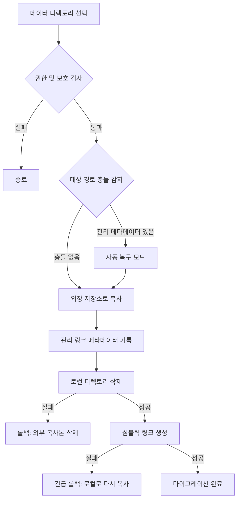

# 데이터 마이그레이션 기본 구현


AppPorts의 데이터 마이그레이션 기능은 앱과 관련된 데이터 디렉토리(예: `~/Library/Application Support`, `~/Library/Caches` 등)를 외장 저장소로 마이그레이션하여 로컬 디스크 공간을 확보합니다.

## 핵심 전략: 심볼릭 링크

데이터 디렉토리 마이그레이션은 **Whole Symlink** 전략을 사용합니다:

1. 원본 로컬 디렉토리 전체를 외장 저장소로 복사
2. 관리 링크 메타데이터(`.appports-link-metadata.plist`)를 외부 디렉토리에 기록
3. 원본 로컬 디렉토리 삭제
4. 원본 경로에 외부 복사본을 가리키는 심볼릭 링크 생성

```
~/Library/Application Support/SomeApp
    → /Volumes/External/AppPortsData/SomeApp  (symlink)
```

## 마이그레이션 흐름



## 관리 링크 메타데이터

AppPorts는 외부 디렉토리에 `.appports-link-metadata.plist` 파일을 기록하여 해당 디렉토리가 AppPorts에 의해 관리됨을 식별합니다. 메타데이터에는 다음이 포함됩니다:

| 필드 | 설명 |
|------|------|
| `schemaVersion` | 메타데이터 버전 번호 (현재 1) |
| `managedBy` | 관리자 식별자 (`com.shimoko.AppPorts`) |
| `sourcePath` | 원본 로컬 경로 |
| `destinationPath` | 외장 저장소 대상 경로 |
| `dataDirType` | 데이터 디렉토리 유형 |

이 메타데이터는 스캔 시 AppPorts가 관리하는 링크와 사용자가 생성한 심볼릭 링크를 구분하는 데 사용되며, 마이그레이션 중단 시 자동 복구를 지원합니다.

## 지원되는 데이터 디렉토리 유형

| 유형 | 경로 예시 |
|------|----------|
| `applicationSupport` | `~/Library/Application Support/` |
| `preferences` | `~/Library/Preferences/` |
| `containers` | `~/Library/Containers/` |
| `groupContainers` | `~/Library/Group Containers/` |
| `caches` | `~/Library/Caches/` |
| `webKit` | `~/Library/WebKit/` |
| `httpStorages` | `~/Library/HTTPStorages/` |
| `applicationScripts` | `~/Library/Application Scripts/` |
| `logs` | `~/Library/Logs/` |
| `savedState` | `~/Library/Saved Application State/` |
| `dotFolder` | `~/.npm`, `~/.vscode` 등 |
| `custom` | 사용자 정의 경로 |

## 복원 흐름

1. 로컬 경로가 유효한 외부 디렉토리를 가리키는 심볼릭 링크인지 확인
2. 로컬 심볼릭 링크 제거
3. 외부 디렉토리를 로컬로 다시 복사
4. 외부 디렉토리 삭제 (최대한 시도)

복사가 실패하면 일관성을 유지하기 위해 심볼릭 링크를 자동으로 재구성합니다.

## 오류 처리 및 롤백

마이그레이션 프로세스의 각 핵심 단계에는 롤백 메커니즘이 포함됩니다:

- **복사 실패**: 추가 작업을 수행하지 않음; 복사된 외부 파일 정리
- **로컬 디렉토리 삭제 실패**: 외부 복사본을 삭제하고 원래 상태로 복원
- **심볼릭 링크 생성 실패**: 외부에서 로컬로 데이터를 다시 복사하고 외부 복사본 삭제

이 설계는 어떤 단계에서든 실패 시 데이터 손실이 없고 시스템 상태가 일관되도록 보장합니다.
