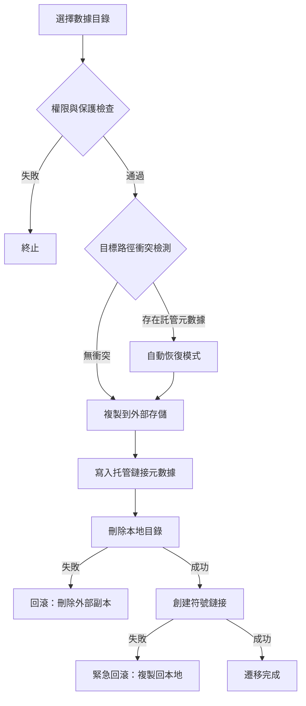

# 數據遷移基礎實現

AppPorts 的數據遷移功能負責將應用關聯的數據目錄（如 `~/Library/Application Support`、`~/Library/Caches` 等）遷移至外部存儲，以釋放本地磁盤空間。

## 核心策略：符號鏈接

數據目錄遷移採用**整體符號鏈接**策略，流程如下：

1. 將原始本地目錄完整複製到外部存儲
2. 在外部目錄寫入托管鏈接元數據（`.appports-link-metadata.plist`）
3. 刪除本地原始目錄
4. 在原始路徑創建符號鏈接，指向外部存儲中的副本

```
~/Library/Application Support/SomeApp
    → /Volumes/External/AppPortsData/SomeApp  （符號鏈接）
```

## 遷移流程



## 託管鏈接元數據

AppPorts 在外部目錄中寫入 `.appports-link-metadata.plist` 文件，用於標識該目錄由 AppPorts 管理。元數據包含：

| 字段 | 說明 |
|------|------|
| `schemaVersion` | 元數據版本號（當前爲 1） |
| `managedBy` | 管理者標識（`com.shimoko.AppPorts`） |
| `sourcePath` | 原始本地路徑 |
| `destinationPath` | 外部存儲目標路徑 |
| `dataDirType` | 數據目錄類型 |

該元數據在掃描階段用於區分 AppPorts 創建的託管鏈接與用戶手動創建的符號鏈接，並在遷移中斷時支持自動恢復。

## 支持的數據目錄類型

| 類型 | 路徑示例 |
|------|----------|
| `applicationSupport` | `~/Library/Application Support/` |
| `preferences` | `~/Library/Preferences/` |
| `containers` | `~/Library/Containers/` |
| `groupContainers` | `~/Library/Group Containers/` |
| `caches` | `~/Library/Caches/` |
| `webKit` | `~/Library/WebKit/` |
| `httpStorages` | `~/Library/HTTPStorages/` |
| `applicationScripts` | `~/Library/Application Scripts/` |
| `logs` | `~/Library/Logs/` |
| `savedState` | `~/Library/Saved Application State/` |
| `dotFolder` | `~/.npm`、`~/.vscode` 等 |
| `custom` | 用戶自定義路徑 |

## 還原流程

1. 驗證本地路徑爲符號鏈接且指向有效外部目錄
2. 移除本地符號鏈接
3. 將外部目錄複製回本地
4. 刪除外部目錄（盡力而爲）

若複製失敗，自動重建符號鏈接以保證一致性。

## 錯誤處理與回滾

遷移過程中的每個關鍵步驟均包含回滾機制：

- **複製失敗**：不執行後續操作，清理已複製的外部文件
- **刪除本地目錄失敗**：刪除外部副本，恢復原始狀態
- **創建符號鏈接失敗**：將數據從外部複製回本地，刪除外部副本

這種設計確保在任何階段發生故障時，數據不會丟失且系統狀態保持一致。