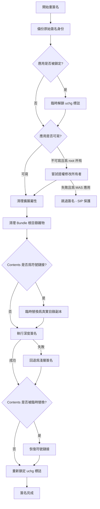

# 重簽名與崩潰防護

## 爲什麼遷移數據後應用可能崩潰

macOS 的代碼簽名機制（`codesign`）會驗證應用包的完整性，包括文件路徑結構。當 AppPorts 將應用的數據目錄遷移至外部存儲並替換爲符號鏈接後，簽名密封被破壞，導致以下問題：

- **Gatekeeper 攔截**：`codesign --verify --deep --strict` 檢測到簽名失效，系統彈出「已損壞」或「來自身份不明的開發者」對話框，阻止應用啓動
- **Keychain 訪問中斷**：依賴 Keychain 訪問組的應用因簽名身份變更而無法讀取存儲的憑據
- **授權（Entitlements）失效**：部分應用的授權與簽名身份綁定，簽名變更後授權不匹配

### 高風險應用類型

| 應用類型 | 風險等級 | 原因 |
|----------|----------|------|
| Sparkle 自更新應用 | **高** | 更新器可能刪除或替換應用，破壞符號鏈接 |
| Electron 自更新應用 | **高** | `electron-updater` 同樣可能干擾外部存儲上的應用 |
| 依賴 Keychain 的應用 | **高** | Ad-hoc 簽名變更了簽名身份，Keychain 訪問組失效 |
| Mac App Store 應用 | **高** | SIP 保護，無法重簽名 |
| 原生自更新應用（Chrome、Edge） | 中 | 自更新可能替換外部副本，使本地入口失效 |
| iOS 應用（Mac 版） | 低 | 使用 Stub Portal 或整體符號鏈接，簽名問題較少 |

### 高風險數據目錄類型

| 數據類型 | 風險等級 | 原因 |
|----------|----------|------|
| `~/Library/Application Support/` | 中 | 應用可能使用文件鎖、SQLite WAL 日誌或擴展屬性，跨符號鏈接時可能異常 |
| `~/Library/Group Containers/` | 中 | 同一 Team 下多應用共享，符號鏈接可能干擾其他應用 |
| `~/Library/Preferences/` | 低-中 | `cfprefsd` 緩存 plist 文件，符號鏈接可能導致讀取過期數據 |
| `~/Library/Caches/` | 低 | 緩存可重建，多數應用可優雅處理緩存缺失 |

## 重簽名機制

### Ad-hoc 簽名

AppPorts 使用 **Ad-hoc 簽名**（無證書的本地簽名）來修復遷移後的應用簽名。執行命令：

```bash
codesign --force --deep --sign - <應用路徑>
```

其中 `-` 表示 Ad-hoc 簽名（不使用開發者證書）。

### 簽名流程



### 關鍵步驟說明

1. **備份原始簽名身份**：在簽名前，讀取應用當前的簽名身份信息（通過 `codesign -dvv` 解析 `Authority=` 行），保存至 `~/Library/Application Support/AppPorts/signature-backups/<BundleID>.plist`

2. **清理擴展屬性**：執行 `xattr -cr` 移除資源分支、Finder 信息等，避免簽名時出現 "detritus not allowed" 錯誤

3. **清理 Bundle 根目錄**：移除 `.DS_Store`、`__MACOSX`、`.git`、`.svn` 等雜物

4. **處理符號鏈接的 Contents**：若 `Contents/` 是符號鏈接（Deep Contents Wrapper 策略），臨時將其替換爲真實目錄副本，簽名完成後再恢復符號鏈接

5. **深度簽名 → 淺層簽名回退**：優先執行 `--deep` 簽名（覆蓋所有嵌套組件），若因權限或資源分支問題失敗，回退爲不帶 `--deep` 的淺層簽名

6. **重試機制**：`codesign` 出現 "internal error" 或被 SIGKILL 終止時，最多重試 2 次

## 簽名備份與恢復

### 備份

備份文件保存在 `~/Library/Application Support/AppPorts/signature-backups/` 目錄下，以 `BundleID.plist` 命名：

| 字段 | 說明 |
|------|------|
| `bundleIdentifier` | 應用的 Bundle ID |
| `signingIdentity` | 原始簽名身份（如 `Developer ID Application: ...` 或 `ad-hoc`） |
| `originalPath` | 原始應用路徑 |
| `backupDate` | 備份時間 |

備份在以下時機觸發：

- 數據目錄遷移前（若開啓了自動重簽名）
- 任何簽名操作執行前（冪等，不會覆蓋已有備份）

### 恢復

恢復簽名時，AppPorts 根據備份的簽名身份執行不同策略：

| 備份的簽名身份 | 恢復行爲 |
|---------------|----------|
| `ad-hoc` 或爲空 | 執行 `codesign --remove-signature` 移除簽名，刪除備份 |
| 有效的開發者證書身份 | 檢查鑰匙串中是否存在該證書。若存在，使用原始身份重新簽名 |
| 有效的開發者證書身份，但證書不在本機 | **回退爲 Ad-hoc 簽名**，原始簽名無法完整恢復 |

### 恢復失敗的情況

以下場景會導致簽名恢復失敗或不完整：

| 場景 | 結果 |
|------|------|
| 備份 plist 文件不存在 | 拋出 `noBackupFound` 錯誤，無法恢復 |
| 原始開發者證書不在本機鑰匙串中 | 回退爲 Ad-hoc 簽名。應用可啓動，但 Keychain 訪問組和部分授權可能失效 |
| Mac App Store 應用（SIP 保護） | 靜默跳過。SIP 阻止對系統應用簽名的任何修改 |
| 應用目錄不可寫且爲 root 所有 | 嘗試通過管理員權限修改所有者。若用戶取消授權提示則失敗 |
| Contents 符號鏈接目標已丟失 | 臨時替換步驟中 `copyItem` 失敗，簽名無法執行 |
| 用戶取消管理員權限授權 | 拋出 `codesignFailed("用戶取消了權限授權")` |
| 深度簽名和淺層簽名均失敗 | 錯誤向上傳播，簽名操作失敗 |

::: warning ⚠️ 關於開發者證書丟失
最常見的實際恢復失敗場景是：原始應用由第三方開發者簽名（如 `Developer ID Application: Google LLC`），但當前機器的鑰匙串中沒有對應的私鑰。此時恢復操作只能生成 Ad-hoc 簽名，**原始簽名身份無法完整還原**。對於依賴特定簽名身份的 Keychain 訪問組或企業配置描述文件的應用，這可能導致功能異常。
:::
